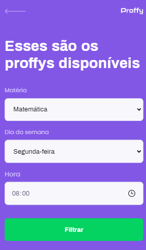

<h1 align="center">
    
</h1>

<h4 align="center"> 
	Proffy 1.0 🚀 Concluído
</h4>

  

  

## 💻 Sobre o projeto

 Proffy - é uma forma de conectar professores e estudantes que precisam de um reforço escolar na intenção de melhorar o desempenho escolar de maneira simples, eficiente e barata.

Os professores poderão se cadastrar na plataforma web, clicando no botão Dar aulas que fica na página inicial. 

Na página de cadastro, será necessário enviar os seguintes dados pessoais: 
-Nome Completo 
-Link da sua foto 
-Whatsapp 
-Biografia

Além disso, é necessário preencher informações sobre a aula, cadastrando:
- Matéria nas seguintes opções: 
    *Artes; 
    *Biologia; 
    *Ciências; 
    *Educação física; 
    *Física; 
    *Geografia; 
    *História; 
    *Matemática; 
    *Português; 
    *Química 

- Custo da sua hora/aula(R$)

E para finalizar preencha os horários disponíveis, marcando: 
-Dia da semana; 
-Horário inicial(Das) 
-Horário final(Até) 

Dessa forma, já será possível salvar o cadastro do professor na plataforma Proffy.

Os estudantes poderão visualizar os professores disponíveis, clicando no botão Estudar, que fica na página inical.

Dentro da página de visualização dos professores, é necessário preenchar qual a matéria, o dia da semana e a hora desejada pela estudante e clicar no botão Filtrar.
Caso, exista um algum professor cadastrado de acordo com o filtro, será exibido. Porém caso não exista cadastro, será mostrado a mensagem que não foi encontrado nenhum professor para a sua pesquisa.

Projeto desenvolvido durante a **NLW2 - Next Level Week2** oferecida pela [Rocketseat].

## 🎨 Layout

O layout da aplicação está disponível nas versões Mobile e Web.

### Mobile

  

  
  

